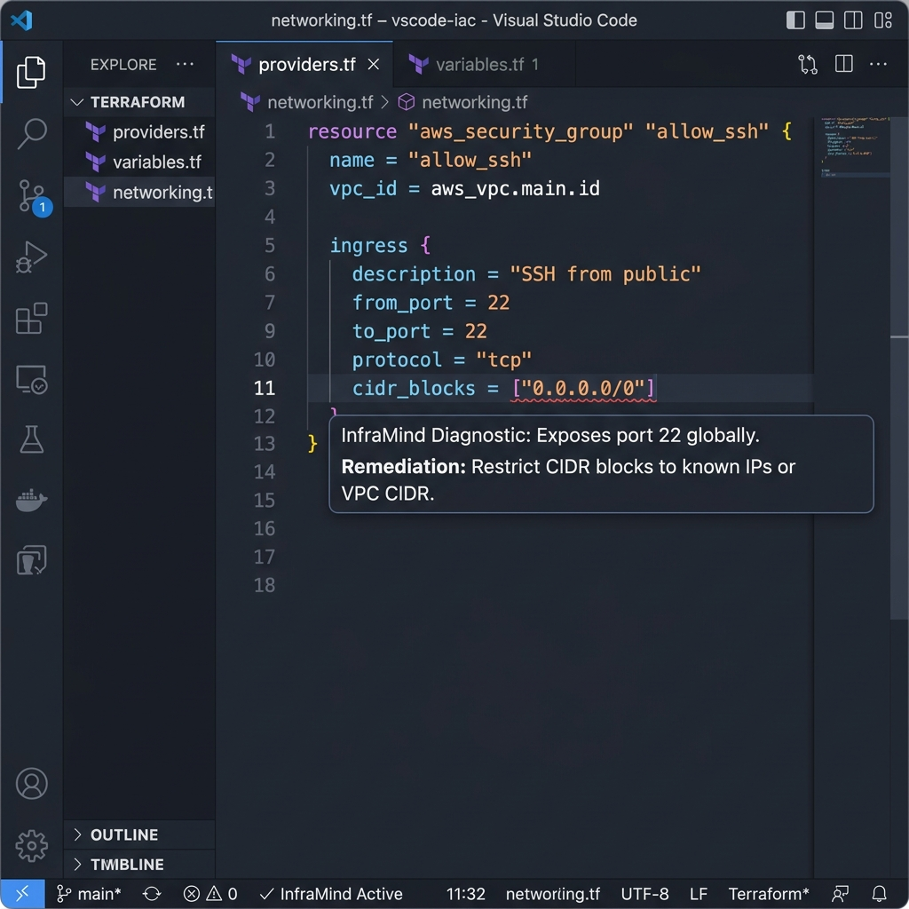
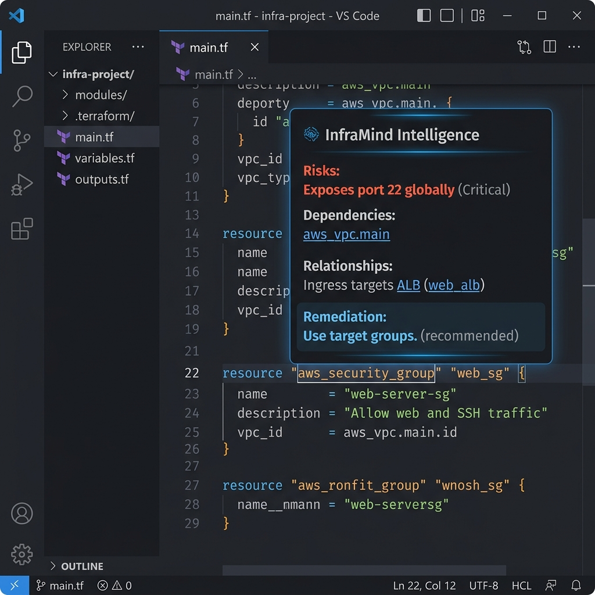
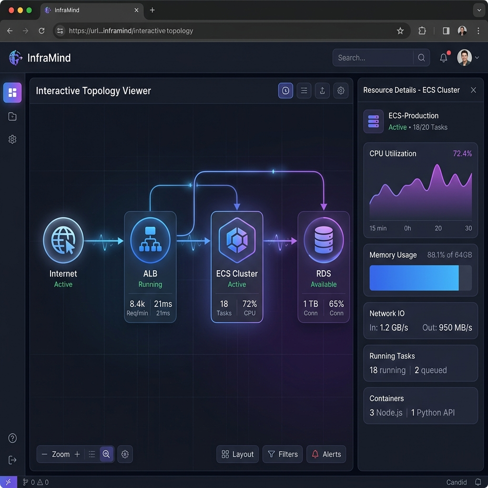
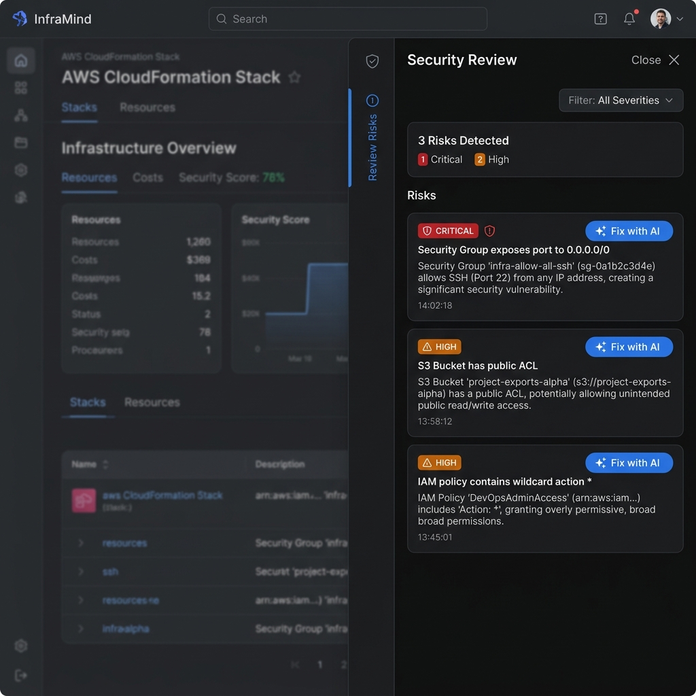
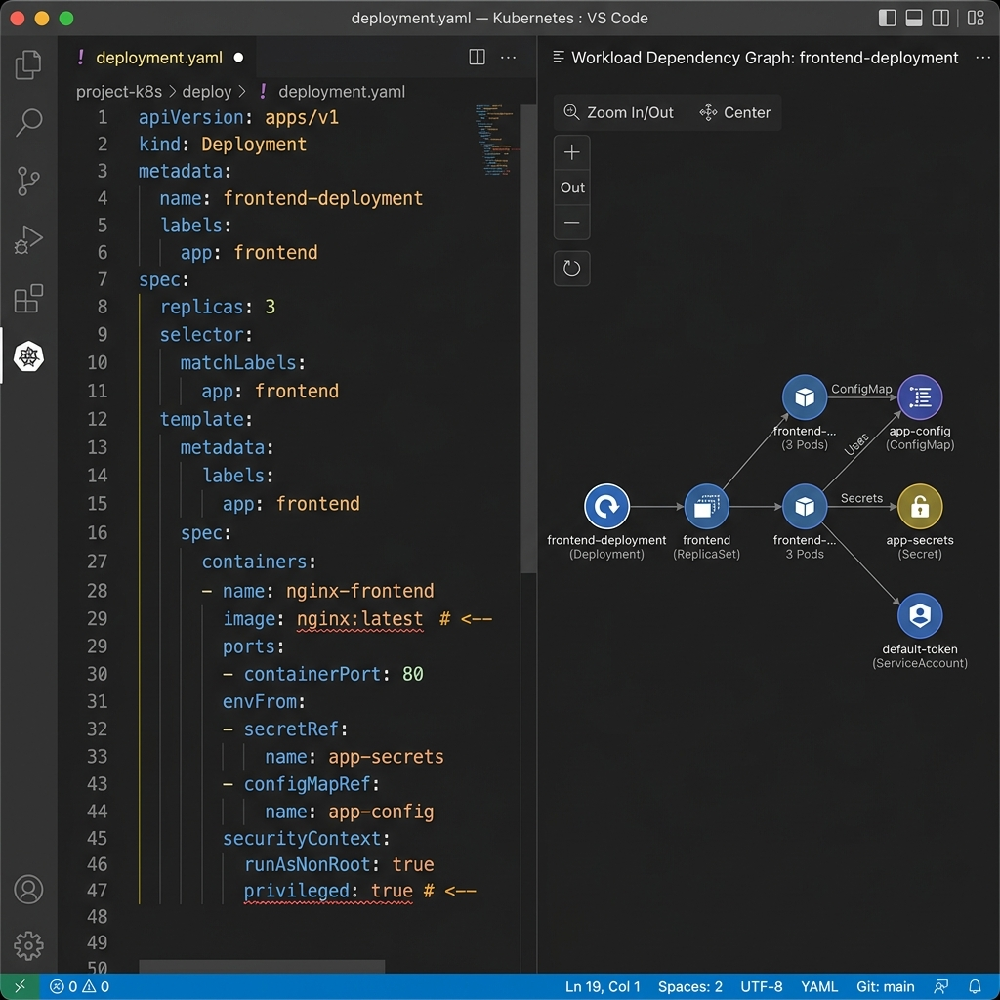
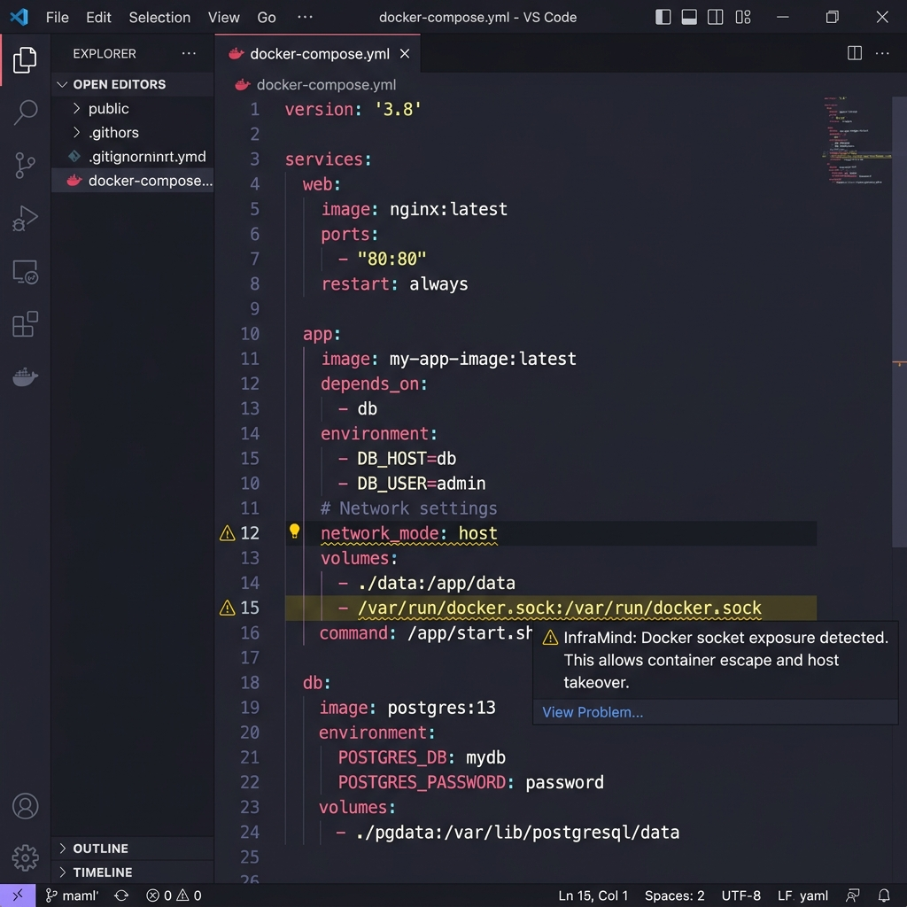
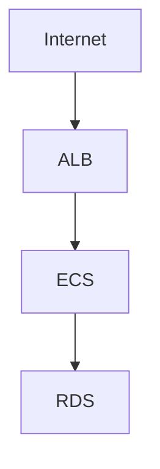
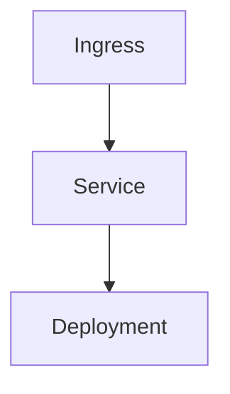

<div align="center">
  
  <h1>InfraMind</h1>
  <p><b>AI-native Infrastructure Intelligence for Terraform, Kubernetes, and Docker.</b></p>
  
  [](https://github.com/inframind/inframind/actions)
  [](https://opensource.org/licenses/MIT)
  [](https://marketplace.visualstudio.com/)
  [](https://python.org)
</div>

---

## 2. Why InfraMind Exists

Modern infrastructure is complex, highly abstracted, and heavily interdependent. Generic AI copilots fail at infrastructure because they attempt to pattern-match code strings without understanding the underlying architectural topology.

InfraMind is not a generic AI assistant. It is a **deterministic infrastructure cognition engine**. 

We parse Terraform, Kubernetes, and Docker locally to build a semantic graph of your infrastructure. This local-first security model ensures your raw infrastructure code never leaves your machine. We only use AI reasoning as an optional, high-leverage layer on top of our structured intelligence.

---

## 3. Core Features

### 🏗️ Terraform Intelligence
- **Semantic Parsing:** High-fidelity HCL parsing and state extraction.
- **Diagnostics:** Real-time, inline security and complexity validation.
- **Topology Visualization:** Automatic blast-radius mapping for AWS resources.

### ☸️ Kubernetes Intelligence
- **Workload Mapping:** Deep dependency linking between Ingresses, Services, and Deployments.
- **Security Heuristics:** Pinpoint privileged execution, root escalation, and plaintext secrets.
- **Dependency Graphing:** Visual representations of your cluster architecture.

### 🐋 Docker Intelligence
- **Compose Topology:** Deterministic mapping of inter-service network boundaries.
- **Privileged Detection:** Immediate flagging of dangerous host-level escalations.
- **Container Security Analysis:** Dockerfile deep-dives for dangerous package and user specs.

### ⚡ VS Code UX
- **Inline Diagnostics:** Immediate feedback loops powered by debounced local parsing.
- **Hover Intelligence:** Context-aware infrastructure data on hover.
- **Topology Graphs:** Interactive Mermaid diagrams rendered natively in Webviews.
- **Deterministic Responsiveness:** Lightning-fast UI, powered by local evaluation.

### 🧠 AI Reasoning Layer
- **Groq-powered Analysis:** High-speed LLM insights for complex remediation.
- **Structured Context Reasoning:** We send the graph, not the raw code.
- **Token-Efficient Workflows:** Massive cost savings via deterministic pre-processing.

---

## 4. Architecture Overview

InfraMind operates via a strict pipeline to ensure security and speed:

```text
Terraform / Kubernetes / Docker
             ↓
  Semantic Parsing Engine (hcl2 / pyyaml)
             ↓
  Dependency Graph Engine
             ↓
  Security + Complexity Analysis (Heuristics)
             ↓
  Structured Infrastructure Intelligence (InfraSummary)
             ↓
  VS Code Diagnostics + Topology Visualization
             ↓
  Optional AI Reasoning Layer (Groq LLM)
```

**Why this architecture?**
By avoiding raw-code-to-LLM workflows, InfraMind guarantees a **local-first processing** environment. We rely on deterministic parsers to do the heavy lifting, ensuring zero hallucinations for security alerting and immediate feedback speeds. 

---

## 5. Visual Tour (Screenshots)

### Inline Diagnostics


### Hover Intelligence


### Architecture Topology Visualization


### Security Reporting Panel


### Kubernetes Intelligence


### Docker Intelligence


---

## 6. Topology Graph Generation

InfraMind automatically builds architectural maps from your code. 

**Terraform (AWS) Example:**


**Kubernetes Example:**


---

## 7. The Local-First Philosophy

Infrastructure code is the keys to the kingdom. InfraMind adheres strictly to a local-first philosophy:

- **Infrastructure Privacy:** Raw source code and hardcoded secrets never touch a cloud API.
- **Minimal Outbound Context:** If AI reasoning is requested, only the structured dependency graph and metadata are dispatched.
- **Deterministic Workflows:** Security checks are hardcoded heuristics, ensuring consistency.
- **Trustworthiness:** We don't require access to your AWS credentials or cloud state files.

---

## 8. Installation

### Backend Setup (FastAPI)
1. Clone the repository.
2. Navigate to the backend: `cd apps/backend`
3. Install dependencies: `pip install -r requirements.txt`
4. Provide a Groq API Key (Optional for AI reasoning): `export GROQ_API_KEY=your-key`
5. Start the server: `uvicorn app.main:app --reload`

### VS Code Extension Setup
1. Navigate to the extension: `cd apps/vscode-extension`
2. Install dependencies: `npm install`
3. Launch the extension: Open in VS Code and press `F5` to open the Extension Development Host.

---

## 9. Development Workflow

We enforce a strict development standard. 
*   **Compile Extension**: `npm run compile` (inside `apps/vscode-extension`)
*   **Start Backend**: `uvicorn app.main:app` (inside `apps/backend`)
*   **Run Regression Suite**: 
```bash
python run_tests.py
```

---

## 10. Adversarial Test Suite

InfraMind ships with a massive, programmatically generated `tests/` directory acting as a formal regression harness.

- **Malformed Infra Testing:** Validates that incomplete YAML/HCL won't crash the extension.
- **False-Positive Validation:** Ensures secure infra isn't incorrectly flagged.
- **Performance Fixtures:** Stress tests (300+ interwoven resources) validating parsing speed.

---

## 11. Roadmap

- **Phase 1 (Current):** Semantic infrastructure cognition.
- **Phase 2:** Semantic graph persistence and history.
- **Phase 3:** Architecture diffing (PR-level topology changes).
- **Phase 4:** Intelligent remediation suggestions and automated refactoring blocks.

---

## 12. Contributing

Read our full [Contributing Guidelines](CONTRIBUTING.md) to understand our issue workflows, coding standards, and testing expectations. All Pull Requests must pass the `run_tests.py` regression suite.

---

## 13. License

Released under the [MIT License](LICENSE).
