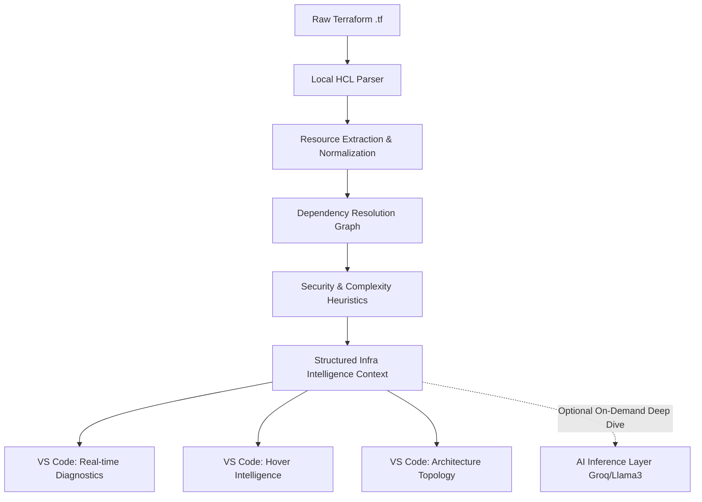

# 🧠 InfraMind

**Local-first Infrastructure Cognition Layer for Modern DevOps.**

InfraMind is an AI-native infrastructure intelligence platform designed specifically for Terraform. Unlike generic coding assistants or cloud-locked security scanners, InfraMind builds a deterministic, semantic understanding of your infrastructure *locally*, and uses AI reasoning only when you request an architectural deep-dive.

**Stop guessing blast radiuses. Start seeing your infrastructure.**

---

## ✨ Features

### 🔍 Deterministic Semantic Parsing
InfraMind parses raw HCL locally in milliseconds, extracting resources, implicit dependencies, and security heuristics without uploading your codebase to the cloud.

### 🌐 Instant Topology Visualization
Generate deterministic Mermaid diagrams of your infrastructure architecture with a single command. See your dependencies visually—no dragging and dropping required.

### ⚡ Real-Time IDE Diagnostics
Type `0.0.0.0/0` and immediately see a critical security diagnostic squiggly right inside your editor. InfraMind creates an instant feedback loop for infrastructure security.

### 💡 Contextual Hover Intelligence
Hover over any Terraform resource to see:
- Normalized service boundaries
- Inbound and outbound connections (blast radius)
- Heuristically detected security risks
- Recommended remediation

### 🤖 On-Demand AI Reasoning
When the deterministic graph isn't enough, press "Explain with AI" to trigger a deep architectural review. The local context engine pipes a structured semantic graph to `llama3-70b-8192` (via Groq) to provide expert-level cloud security and cost insights.

---

## 🏗 Architecture

We don't believe in "Terraform -> GPT Prompts". 
InfraMind is built on the philosophy of **Intelligence Density**.



---

## 🚀 Getting Started

InfraMind is built as a fast, modular monorepo. 

### Prerequisites
- Node.js & npm (for VS Code Extension)
- Python 3.10+ (for Local Context Engine)
- VS Code `^1.80.0`

### 1. Start the Local Intelligence Backend
```bash
cd apps/backend
python -m venv venv
source venv/bin/activate
pip install -r requirements.txt

# Start the Fast API parser
uvicorn app.main:app --reload
```

### 2. Run the Extension
```bash
cd apps/vscode-extension
npm install
npm run compile
```
*Open `apps/vscode-extension` in VS Code, and press `F5` to start debugging.*

---

## 🎯 Philosophy & Positioning

InfraMind is **not** an "AI DevOps chatbot". 
It is a **Local-first Infrastructure Cognition Layer**.

Infrastructure engineers handle the most sensitive, critical components of a company's technical foundation. Sending entire infrastructure repositories to a black-box cloud LLM on every keystroke is an unacceptable security posture. 

InfraMind parses and understands your topology locally, generating immediate deterministic value (diagnostics, diagrams, dependency trees) at zero cost. It leverages the cloud LLM exclusively as an *on-demand reasoning engine* fed with a structured, pre-digested semantic graph.

**Faster. More Secure. Architecturally Aware.**

---

## 🗺 Roadmap

- **Phase 1:** Feature Freeze & Stabilization *(Current)*
- **Phase 2:** UX Polish & VS Code Native Styling
- **Phase 3:** Deterministic Quick Fixes
- **Phase 4:** Open Source Launch
