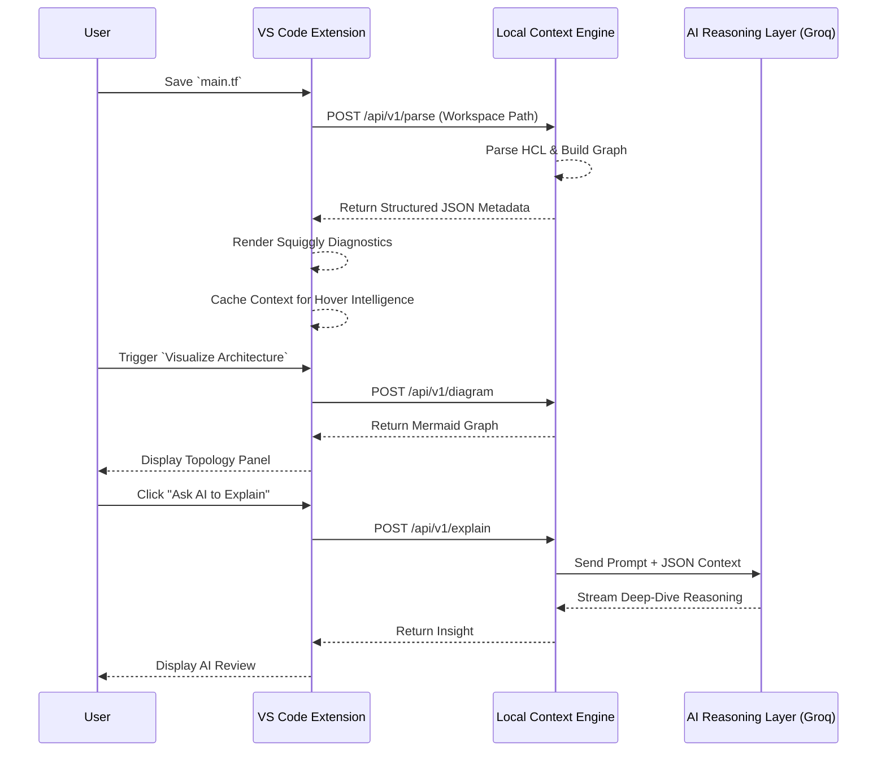

# InfraMind System Architecture

InfraMind fundamentally differs from legacy AI coding assistants by inserting a robust **Deterministic Context Engine** between the raw source code and the AI Reasoning layer.

## The Problem with Naive AI Wrappers

Most AI developer tools operate on a naive pipeline:
`Raw Code -> LLM Prompt -> Result`

When applied to infrastructure (Terraform, Kubernetes), this naive approach suffers from:
1. **Context Window Exhaustion:** Sending hundreds of `.tf` files is expensive and slow.
2. **Hallucinations:** The LLM fails to understand implicit dependencies.
3. **Security Risks:** Streaming entire infrastructure repos to the cloud on every keystroke violates enterprise security policies.

## The InfraMind Solution: Intelligence Density

InfraMind shifts the paradigm to **Local-First Semantic Intelligence**. 

### 1. Local Parsing Layer
A fast, local Python FastAPI server utilizes `python-hcl2` to rip through the workspace on file-save. It converts raw HCL into a Python AST without the code ever leaving the user's machine.

### 2. Dependency Graph & Security Heuristics
The local engine extracts resources, normalizes cloud services (e.g., `aws_instance` -> `EC2`), maps `source -> target` dependencies, and runs deterministic security heuristics (e.g., detecting `0.0.0.0/0` exposure). 

### 3. Structured Intelligence Context
The output of the local engine is a rigorously typed Pydantic JSON object containing `resources`, `dependencies`, `security_risks`, and `complexity_metrics`. 

### 4. Zero-Latency IDE Integration
The VS Code Extension completely bypasses the AI for its core UI. It consumes the local JSON context to provide **instant, deterministic feedback**:
- Real-time Squiggly Diagnostics
- Hover Insights
- Mermaid Architecture Diagrams

### 5. On-Demand AI Reasoning Layer
When the user explicitly requests an architectural deep dive ("Explain with AI"), InfraMind does **not** send the raw code to the LLM. Instead, it sends the pre-digested Structured JSON Context. 
Because the LLM receives perfectly structured topology graphs rather than raw string-bloat, a much smaller, faster model (like `Llama-3-70b`) can deliver devastatingly accurate, principal-engineer-level insights.

## Diagram

